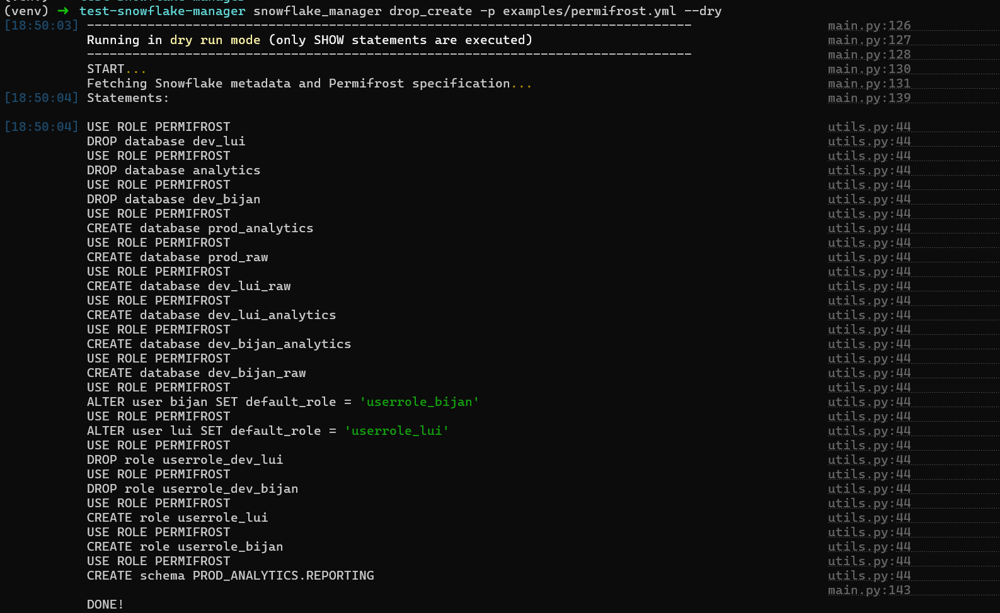

# snowflake-manager
Python package to manage Snowflake objects and permissions

- **drop_create** to create Snowflake objects that are needed


## Setup

### Install
Create virtual environment
```bash
python3 -m venv venv
source venv/bin/activate
```

Install from the GitHub repository
```bash
pip install git+ssh://git@github.com/Gemma-Analytics/snowflake-manager.git
```

## Use

Dry run to drop and create objects
```bash
snowflake_manager drop_create -p examples/permifrost.yml --dry
```