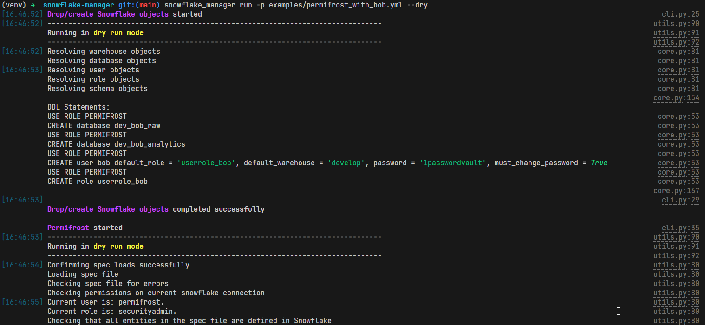

# snowflake-manager
Python package to manage Snowflake objects and permissions

- **Drop and create** Snowflake objects that are needed
- Set up permissions for the objects using **Permifrost**

#### Preview



## How to use
The `run` subcommand is going to drop/create objects and run Permifrost.

### Dry run

```bash
snowflake_manager run --permifrost_spec_path examples/permifrost.yml --dry
```

### Normal run
```bash
snowflake_manager run --permifrost_spec_path examples/permifrost.yml
```

## Setup

### Install
Create virtual environment, activate and upgrade `pip`
```bash
python3 -m venv venv
source venv/bin/activate
pip install --upgrade pip
```

Install from the GitHub repository
```bash
pip install git+https://github.com/Gemma-Analytics/snowflake-manager.git
```

> Note: you can specify a tag to install a specific version:
> 
> ```bash
> pip install git+https://github.com/Gemma-Analytics/snowflake-manager.git@v1.0.0
> ```

## Configure

### Permifrost
Add a valid Permifrost spec file to your repository. You can use the example provided in the `examples` folder.

### Snowflake
Create Snowflake account with user `permifrost` as the initial user. If you want to use a CI/CD later, ideally use a long password with characters and numbers but without symbols using a tool like 1Password.

> Note: This user should be the first (and only) user you create manually when first creating your Snowflake account

Grant needed permissions using the following SQL statements after logging in:

```sql
CREATE ROLE permifrost;
GRANT ROLE securityadmin TO ROLE permifrost;
GRANT ROLE sysadmin TO ROLE permifrost;
USE ROLE securityadmin;
CREATE WAREHOUSE admin;
CREATE DATABASE permifrost;
ALTER USER permifrost SET DEFAULT_WAREHOUSE = admin DEFAULT_ROLE = permifrost;
GRANT ROLE permifrost TO USER permifrost;
ALTER USER permifrost SET DEFAULT_ROLE = permifrost;
```

### Environment variables

Set up your Snowflake connection details in the environment variables listed below. 
```bash
PERMISSION_BOT_ACCOUNT=abc134.west-europe.azure  # Your account identifier
PERMISSION_BOT_DATABASE=PERMIFROST
PERMISSION_BOT_ROLE=PERMIFROST
PERMISSION_BOT_WAREHOUSE=ADMIN
PERMISSION_BOT_USER=PERMIFROST
PERMISSION_BOT_PASSWORD=...
```

## Develop

### Pre-release integration test
> **Attention**: we currently use a manual process to test new releases that is only applicable to Gemma's internal infrastructure

Before merging changes to `main`, please test the changes using the `develop` branch. Steps:

- Create a new branch for the new feature e.g. `my-new-feature`
- When finished, create a PR with `develop` branch as the base branch
- Merge the PR into `develop` branch
- In Gemma's best practices repo, merge a dummy change on `permifrost.yml` to trigger the CI/CD pipelines (they are configured to install `snowflake-manager` from the `develop` branch)
- If both the PR (dry run) and merge to main (normal run) pipelines work, proceed to create a new PR in this repo from branch `develop` to `main`
- Once the PR from `develop` to `main` is merged, the changes will be available to all clients 

### Local setup

Install the development dependencies

```bash
pip install -r requirements-dev.txt
```

Install the package locally in editable mode

```bash
pip install --editable .
```
Then you will be able to edit the code and run the CLI to test changes immediately.

### Unit tests
You should run the unit tests after changing the code:
```bash
pytest
```
Likewise, whenever a new functionality is implemented, a new test for it should be added.

### Formatting
Please run the command below to format the code
```bash
black .
```